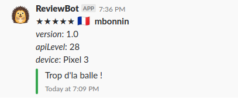

# GooglePlayToSlack

Uses the Google Play developer API to send your Google Play reviews to an incoming slack webhook.

Compared to existing 3rd party services that crawl the google play, it can:

* Get the versionCode, osVersion and device of the review...
* Without exposing your google play account to third parties

It does so using the appengine, Google Play, Translate and DataStore APIs so you'll need a Google Cloud account with billing enabled.
Everything should largely fit in the free tier except for Google Translate that has no free tier so you'll likely end up paying a few cents every month.

## Configuration

* install the google cloud SDK and edit its location in build.gradle
* create a Google Cloud Project
* enable billing for outbound requests to work
* enable the Google Translate API
* link the project to your Google Play account
* create a service account and give it permission on your app in the play console
* create a key for your service account in the Google cloud console
* put this key as a resource named secret.json
* create a resource named config.json with your app packageName and slack incoming webhook
* ./gradlew appengineDeploy
* ./gradlew appengineDeployCron
* profit.

The reviews are updated every 15min by default. You can change that in cron.xml

